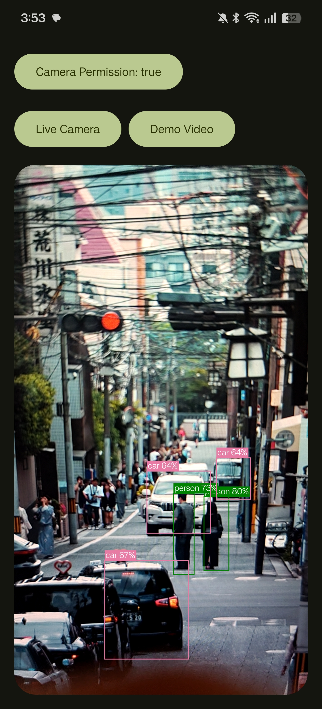
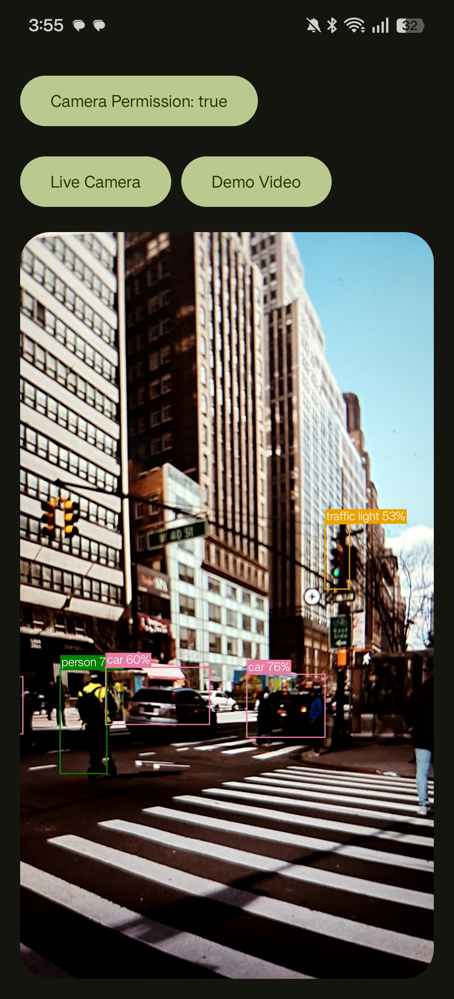
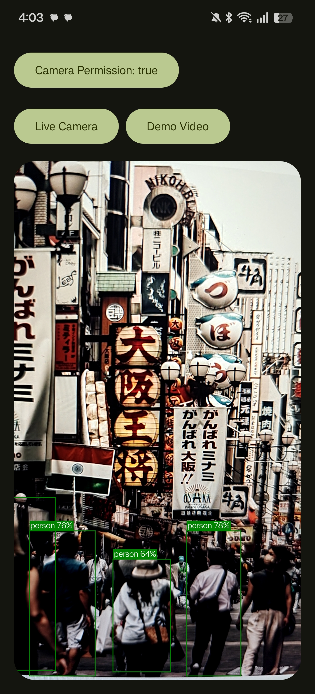

# Accessibility Object Detection

An Android app that runs real-time object detection on a live camera feed (or a demo video) and overlays labeled bounding boxes, aimed at helping users understand what's in front of them — built with Jetpack Compose, CameraX, and MediaPipe Tasks Vision.

## Features

- **Live Camera mode** — runs detection frame-by-frame on the device camera feed.
- **Demo Video mode** — runs the same detection pipeline on a bundled sample video, useful for testing without a camera.
- **Bounding box overlay** — detected objects (people, cars, traffic lights, etc.) are drawn with class label and confidence score.
- **Camera permission status** — visible indicator of whether camera access has been granted.

## Tech stack

- Kotlin + Jetpack Compose
- CameraX (`camera-view`) for camera capture and lifecycle-aware image analysis
- MediaPipe Tasks Vision for on-device object detection

## Model

Detection is powered by a custom-trained object detection model, INT8-quantized for on-device inference via MediaPipe Tasks Vision. COCO-style evaluation results:

| Metric | IoU | Area | maxDets | Score |
|---|---|---|---|---|
| AP | 0.50:0.95 | all | 100 | 0.192 |
| AP | 0.50 | all | 100 | 0.366 |
| AP | 0.75 | all | 100 | 0.192 |
| AP | 0.50:0.95 | small | 100 | 0.050 |
| AP | 0.50:0.95 | medium | 100 | 0.223 |
| AP | 0.50:0.95 | large | 100 | 0.335 |
| AR | 0.50:0.95 | all | 1 | 0.183 |
| AR | 0.50:0.95 | all | 10 | 0.267 |
| AR | 0.50:0.95 | all | 100 | 0.280 |
| AR | 0.50:0.95 | small | 100 | 0.084 |
| AR | 0.50:0.95 | medium | 100 | 0.317 |
| AR | 0.50:0.95 | large | 100 | 0.452 |

**Known limitation:** the model performs noticeably worse on underrepresented classes, due to a lack of training data for those categories.

Training code for the model lives in [maytic/accessibility-detection](https://github.com/maytic/accessibility-detection).

## Demo

| Live Camera | Live Camera | Live Camera |
|---|---|---|
|  |  |  |

A video demo [`readme_file/1000075786.mp4`](readme_file/1000075786.mp4).

## Getting started

1. Clone the repo and open it in Android Studio.
2. Let Gradle sync, then run the app on a device or emulator with a camera (API 24+).
3. Grant camera permission when prompted, then choose **Live Camera** or **Demo Video** to see detection in action.

Or from the command line:

```bash
./gradlew installDebug
```

## Project structure

- `app/src/main/java/com/maytic/objectdetection/` — app source (Compose UI, camera controller, analyzer)
- `readme_file/` — demo screenshots and video used in this README
